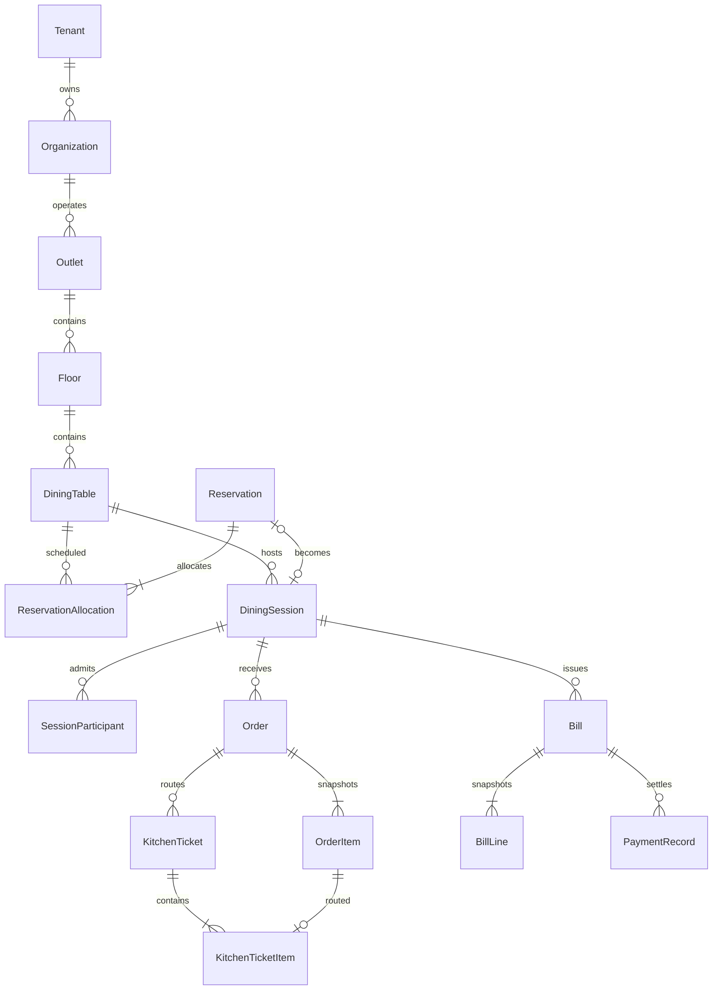
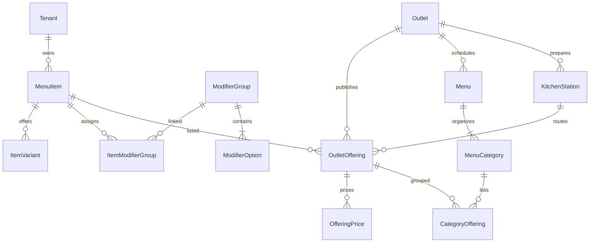

# Data model and ERD

## Conventions

UUID primary keys; `created_at`/`updated_at` UTC timestamps; `version` for mutable aggregates; outlet timezone for presentation; integer minor-unit money (BIGINT) plus ISO currency. DTOs serialize BIGINT money as decimal strings, e.g. `"42000"`, with safe frontend conversion for display. Prices are nonnegative; discounts cannot exceed eligible subtotal. Avoid physical deletion of referenced business/financial records; disable/archive instead.

All tenant-owned tables have `tenant_id NOT NULL`. Outlet-owned tables also have `outlet_id`; composite foreign keys validate both. Even globally unique IDs must not bypass scoped references. Platform/identity tables are separately authorized. Unique constraints include tenant/outlet scope where relevant. Do not log constraint errors that reveal another tenant's identifiers.

## Core ERD

One reservation allocation per reservation in V1; representation allows later multi-table allocation. A session may have historical voided bills plus one current bill, never simultaneous live bills.

## Entity dictionary

| Entity | Required fields / relationships | Important constraints |
|---|---|---|
| Tenant | slug, display_name, status | Unique canonical slug; ACTIVE/SUSPENDED |
| TenantDomain | hostname, tenant_id, verified_at | Unique normalized verified host; no arbitrary client tenant selection |
| Organization | tenant_id, name | Tenant scoped |
| Outlet | tenant_id, organization_id, slug, timezone, currency, status | Unique tenant+slug; organization within tenant |
| OutletSettings | tenant/outlet, hours, duration, buffer, horizon, tax/fee config | Versioned; invalid config blocks relevant publication/billing |
| OutletClosure | tenant/outlet, start/end, reason | End after start; outlet-local input converted to UTC |
| Floor | tenant/outlet, name, sort_order | Outlet scoped |
| DiningTable | tenant/outlet/floor, label, capacity, x/y/width/height/shape, service_state, qr_token_hash, version | Positive capacity; unique outlet label; one current opaque QR token |
| TableBlock | tenant/outlet/table, start/end, reason, actor | Uses allocation schedule; conflicts with confirmed booking |
| Menu | tenant/outlet, name, state | Draft/published; V1 manual publication, no time scheduling |
| MenuCategory | tenant/outlet/menu, name, sort_order | Same scoped menu |
| MenuItem | tenant, name, description, dietary/allergen tags, image_asset_id, archived | Canonical tenant catalogue; no global client data |
| ItemVariant | tenant/item, label, enabled | Variant identity stable; disabling preserves history |
| ModifierGroup | tenant, label, min/max selections | Min≤max; linked to items through ItemModifierGroup |
| ItemModifierGroup | tenant/item/group, sort_order | Unique item+group |
| ModifierOption | tenant/group, label, enabled | Tenant-safe grouping |
| OutletOffering | tenant/outlet/item, station_id, availability, state, version | Unique outlet+item; publication requires price and station |
| OfferingPrice | tenant/outlet/offering, variant_id optional, amount_minor, currency | Exactly one base/variant price per offering/variant |
| OfferingModifierPrice | tenant/outlet/offering/option, amount_minor | Option belongs to an assigned group; explicit outlet add-on price |
| CategoryOffering | tenant/outlet/category/offering, sort_order | No cross-outlet assignment |
| KitchenStation | tenant/outlet, name, active | Retire only after rerouting published offerings |
| Reservation | tenant/outlet, reference, guest name/contact, party_size, start/end, state, management_token_hash, version | Positive guests; scoped reference; no stored plaintext management token |
| ReservationAllocation | tenant/outlet/reservation/table, blocked_time_range, released_at | One per reservation V1; excludes overlapping live table claims |
| DiningSession | tenant/outlet/table, reservation_id nullable, party_size, state, waiter_membership_id nullable, opened/closed_at, deadline, join_pin_hash, entitlement_snapshot, version | Partial unique active table; unique non-null reservation_id |
| SessionParticipant | tenant/outlet/session, capability_hash, expires_at, revoked_at | No link to customer account required; capabilities bound to this session |
| Order | tenant/outlet/session/participant nullable, source, status, idempotency_key, version | Participant belongs to same session; source GUEST/STAFF |
| OrderItem | tenant/outlet/order, offering IDs, label/variant/modifier/price/tax snapshots, quantity, notes, station_id, progress, void_reason | Positive quantity; immutable commercial fields; snapshots survive catalogue change |
| KitchenTicket | tenant/outlet/order/station, created_at | Unique order+station |
| KitchenTicketItem | tenant/outlet/ticket/order_item | One station route per item in V1; same order and station |
| Bill | tenant/outlet/session, number, state, currency, subtotal/discount/tax/fee/rounding/total, calculation_version, issued_at | Unique outlet fiscal sequence key; partial unique current session bill |
| BillLine | tenant/outlet/bill/order_item, snapshots and totals | Each eligible item billed at most once in a live bill |
| PaymentRecord | tenant/outlet/bill, method, amount, reference, recorded_by, recorded_at, state | Manual RECORDED only V1; unique command key; exact outstanding amount |
| Identity | provider, provider_subject, verified_email | Global identity, not tenant-owned authorization |
| Membership | tenant/identity, state | Unique tenant+identity |
| RoleGrant | tenant/membership, role, outlet_id nullable | Tenant-wide grants restricted to owner/admin; outlet roles require outlet |
| StaffInvitation | tenant, email_hash/encrypted_email, role/outlet grants, token_hash, expiry | Single-use; cannot grant more authority than inviter |
| Subscription | tenant, plan_key, status, effective dates | Manual administration V1; no gateway charges |
| Entitlement | tenant, feature_key, enabled, quota, version | Unique tenant+feature; quotas enforced atomically |
| AuditEvent | tenant optional, outlet optional, actor, command, resource, reason, safe before/after | Append-only; avoid contact/token payloads |
| IdempotencyRecord | tenant, principal scope, command, key, request_hash, response, expires_at | Unique complete command scope+key; financial dedupe retained with history |
| OutboxEvent | tenant/outlet optional, resource/version, type, payload, attempts, processed_at | Written in business transaction; at-least-once dispatch |
| MediaAsset | tenant, storage key, content type, checksum, state | Approved MIME/size, private upload, public published-image projection |

## Reservation and occupancy integrity

Represent confirmed reservations and table blocks as schedule claims in one physical allocation table (logical ReservationAllocation/TableBlock views), with claim kind and optional reservation reference. Use `btree_gist` and a PostgreSQL exclusion constraint over tenant, outlet, table and half-open `tstzrange(start, end + cleaning_buffer, '[)')` for unreleased claims. A check enforces exactly the reference applicable to the claim kind. This ensures a table block also conflicts with reservations.

Migrations must use supported immutable constraint expressions: persist the effective range, not a query into settings inside the exclusion expression. Changes to duration/buffer do not rewrite historical claims silently. Availability reads are advisory; allocation constraint is definitive.

Active sessions use a partial unique index on `(tenant_id, outlet_id, table_id)` for states OPEN/CHECKOUT_REQUESTED/BILLED. Reservation check-in has a unique reservation reference in sessions. Before seating, lock table and inspect upcoming claims. This prevents simultaneous walk-ins; expected end does not auto-close a party that remains seated. Confirmed future bookings can coexist with an active session only if the planned occupancy fits before their blocked range.

## Financial integrity

Bill issuance locks session and snapshots all eligible served items. Consume a bill sequence transactionally, keep issued numbers after void, never use row count+1. Financial corrections preserve original records. Manual settlement locks bill, checks exact outstanding amount, writes payment and bill/session/table transitions in one transaction. The same payment command cannot create a second settlement.

Calculation V1: line net = quantity × (variant/base amount + selected add-on amounts). Distribute authorized bill discount across lines proportionally with integer remainder allocation in stable line order. Compute configured tax components per discounted line using integer half-up rounding; sum rounded lines. Fees default to zero; enabled fee/tax treatment must be specified in reviewed settings. Final rounding adjustment defaults to zero. Server persists both inputs and outputs; examples/tests must cover 1-paisa amounts, discount remainders, multiple tax components, and maximum supported values.

## RLS and connection pooling

Apply policies with both USING and WITH CHECK to tenant tables. Obtain tenant context from a transaction-local setting; absence denies access. Tenant runtime role is neither table owner nor BYPASSRLS/superuser. Migration owner is separate; use FORCE ROW LEVEL SECURITY where applicable. Composite constraints prevent references to another tenant even when integrity checks are outside RLS.

Public/menu queries and platform operations use explicit narrow services and projections. Do not give the ordinary API a general elevated bypass role. Outbox cross-tenant dispatch uses a separately scoped job identity, then tenant-bound transactions for processing. Test pool reuse from tenant A to B and missing context against the actual runtime role.

## Retention and evolution

MVP stores only needed guest contact and notes, with configurable retention to be finalized before pilot. Operational and financial retention differ. Minimize PII in snapshots and audit. Archive catalogue entities; migration plans must describe expansion, backfill and removal phases. Future combined tables, split bills, refunds and PMS relationships require new ADRs and cannot be enabled by changing labels alone.
