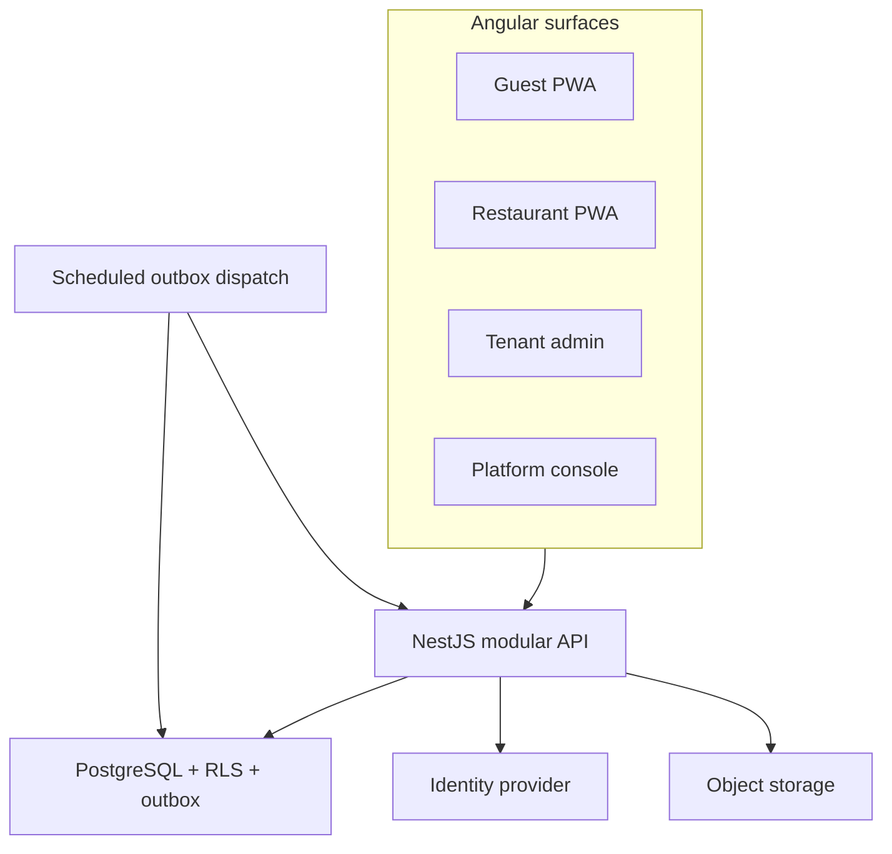

# System design and technical design (TDD)

## Architecture

Use a modular monolith to keep transactions and operations manageable for a solo founder. Four Angular applications consume one NestJS API. The API is split by domain modules with explicit command/query services and persistence adapters, not by frontend app. Do not split services just to mirror navigation.



A scheduled authenticated dispatch operation or Cloud Run Job drains the transactional outbox, publishes update hints, and records delivery attempts. Do not rely on an unawaited background loop under request-based CPU allocation. Realtime hints need shared fanout when more than one API instance is active. PostgreSQL remains authoritative; an optional managed Redis adapter handles live fanout in the real-time milestone. Redis is not needed for the first persistence slice, and is never the only holder of an order or booking.

## Stack and workspace

Angular + PrimeNG + signals; NestJS; PostgreSQL; Drizzle typed queries and versioned SQL migrations; Nx + pnpm. Drizzle makes tenant predicates, constraints and PostgreSQL-specific reservation/RLS behavior explicit. Database migrations remain owned by API persistence libraries. DTOs are transport types with runtime validation; sharing TypeScript interfaces alone does not validate requests.

Target tree (not generated yet):

```
apps/
  guest/web/
  restaurant/web/
  tenant/web/
  platform/web/
  api/
libs/
  shared/contracts/
  shared/ui/
  shared/util/
  web/auth/
  web/tenant-context/
  web/data-access/
  web/floorplans/
  features/{menu,reservations,tables,orders,kitchen,billing,administration}/
  api/{identity,tenancy,authorization,menu,reservations,dining,orders,kitchen,billing,platform}/
  api/persistence/
  api/events/
  api/audit/
infra/
  terraform/
tools/
docs/
```

Nx tags: `type:app|feature|ui|data-access|domain|util`, `scope:guest|restaurant|tenant|platform|shared|api`. Enforce import boundaries: web never imports `scope:api`; contracts never import database/HTTP implementations; domain never imports application shell. Scaffold only libraries needed by the next slice.

Local ports proposed: guest 4200, restaurant 4201, tenant 4202, platform 4203, API 3000. Resolve test tenants via local hostnames and a seeded domain map. Production hosts/domains remain an infrastructure decision; no invented DNS requirements.

## Request and transaction path

Resolve canonical forwarded host only from a trusted proxy, look up tenant/domain, authenticate staff or guest, authorize permission/outlet/module, validate DTO, begin transaction, set tenant context transaction-locally, perform conditional command, record audit/idempotency/outbox, commit, return resource/version. Public menu DTOs are explicit projections; guest capabilities cannot call generic staff resource endpoints.

For reservation creation, lock candidate tables in stable order and insert allocation under exclusion constraints. For seating and payments, lock the table/session/bill respectively. Version checks prevent lost updates. Errors become stable typed responses and correlation IDs; raw database errors and hidden tenant information never reach clients.

## Realtime

Use SSE for update hints because commands remain HTTP requests and the primary interaction is server-to-client changes. Use authenticated fetch streaming for staff bearer tokens or same-origin secure cookies for guests. Do not put tokens in URLs. Event envelope includes event ID, tenant/outlet scope, resource ID and version, event type, occurred time, and no private financial/contact data.

Reconnect with backoff, resubscribe after authorization, then fetch current snapshots. Duplicates and missing events are expected. Polling fallback restores usefulness if streaming is unavailable. Cloud Run connection timeouts apply; do not assume an eternal stream or instance affinity. Separate fanout per scoped audience; verify outlet/participant authorization on connection and revalidate on membership/session changes.

## GCP target

Cloud Run for static frontend servers and API; Cloud SQL PostgreSQL; Cloud Storage for images; Secret Manager; Artifact Registry; external identity provider (Identity Platform target, exact integration in M1); managed Redis optional for fanout; Cloud Scheduler/Cloud Run Jobs for durable dispatch. Region `asia-south1` is the planned deployment region. Infrastructure is not provisioned by this foundation.

Three isolated environments DEV/QA/PROD with separate databases, buckets, credentials and identity configuration. Managed migration job runs before app rollout after compatibility review. Limit Cloud Run instances and connection pools to Cloud SQL capacity. Use private connectivity/service identities and narrowly scoped roles. Production backup/PITR, restore exercise, HTTPS, monitoring, and secret rotation are pre-pilot gates.

## Reliability and observability

Transactions plus idempotency protect retries. Outbox processing is at-least-once; handlers deduplicate event IDs. Dead-letter/failure counters and replay are observable. Logs include correlation ID, actor type, safe tenant/outlet IDs, command, and outcome; omit tokens, phone numbers, order notes, and payment credentials. Metrics: accepted orders, rejection reasons, booking conflicts, command latency/error rates, outbox lag, DB pool saturation, reconnects. Alert on sustained failures and dispatch lag.

Pilot targets to measure: normal command p95 under 1 second and live update visibility under 5 seconds at agreed load (illustrative: 10 outlets, 50 concurrent users per outlet, 10 writes/second aggregate). Run load tests before turning those into service promises. Proposed operational RPO ≤15 minutes and RTO ≤4 hours require configured backups and a measured restore; they are not guaranteed today.

## Sources and limits

- [PostgreSQL row security](https://www.postgresql.org/docs/current/ddl-rowsecurity.html): RLS does not protect against superusers/BYPASSRLS; table owners normally bypass it. Restobook therefore separates migration ownership from runtime role and tests pooled tenant context.
- [Cloud Run request timeouts](https://docs.cloud.google.com/run/docs/configuring/request-timeout): streaming requests still need reconnect behavior when request lifetime ends.
- [Cloud Run WebSocket guidance](https://docs.cloud.google.com/run/docs/triggering/websockets): multi-instance connection synchronization requires shared infrastructure. This informs our SSE deployment design; it is not a claim that that page specifies SSE APIs.

Choices above are Restobook design decisions. Recheck supported versions and service availability during scaffold/infrastructure milestones. No dependency versions or deployment capacities have been installed/verified yet.
