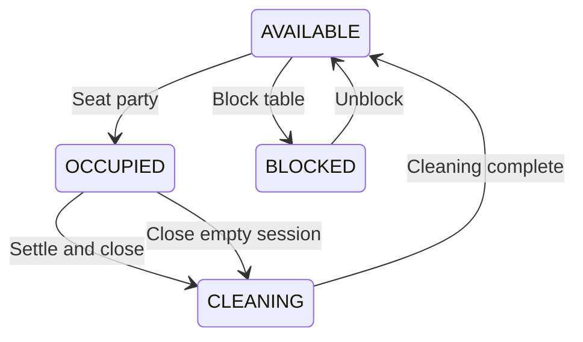
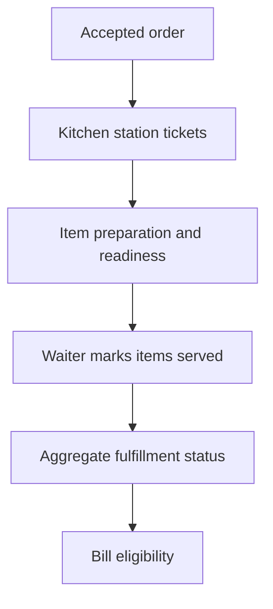

# State machines and invariants

## Reservation

| From | Command | To | Guard / effect |
|---|---|---|---|
| none | Create | CONFIRMED | Atomic table allocation; hours/capacity checked |
| CONFIRMED | Cancel | CANCELLED | Management token or staff permission; release allocation |
| CONFIRMED | Mark no-show | NO_SHOW | Host permission and recorded reason/time |
| CONFIRMED | Check in | CHECKED_IN | Assigned table available; exactly one session |
| CONFIRMED | Reassign / amend | CONFIRMED | Version match; new allocation acquired before releasing old |

CHECKED_IN, CANCELLED, and NO_SHOW are terminal reservation states. A checked-in reservation's allocation remains in the schedule until its planned end/buffer; active session occupancy independently prevents new seating. Early settlement may release the remainder explicitly. Reservation updates never create a second dining session.

## Table and session

Persistent table service state: AVAILABLE, OCCUPIED, CLEANING, BLOCKED. `RESERVED` is a derived badge for an upcoming allocation, not an exclusive persistent state. Ordering, kitchen progress, and bill requested are session badges; a future booking and an occupied table may both appear on the map.

Session states: OPEN → CHECKOUT_REQUESTED → BILLED → CLOSED. Cashier bill issuance moves to BILLED; settlement closes. Manager void of an unpaid bill returns to OPEN; staff can withdraw a checkout request before issuance. An empty session may close without a bill if no accepted billable items or payment exist, with audit reason. Block/unblock cannot hide an active session or confirmed reservation; conflicting blocks return a conflict and require resolving bookings first.

## Orders and tickets

Order begins PLACED. Waiter acceptance creates ACCEPTED and tickets; rejection produces REJECTED. Guest cancellation is allowed while PLACED only. Manager may void accepted items with reasons; an all-voided order becomes VOIDED. Preparation and fulfillment progress are computed from accepted non-voided item states:

ACCEPTED → PREPARING → READY → SERVED per item. Ticket preparing may move all still-accepted items to preparing. Ready and served are item commands. Aggregate order is SERVED only when all eligible items are served; READY only when all are ready or served; PREPARING when any has progressed but those conditions are unmet; otherwise ACCEPTED. Rejected/cancelled/voided items never keep an aggregate pending.

Tickets are station-specific views of item work; their status is derived using the same completeness rule. The API forbids READY → PREPARING, SERVED → READY, and unprivileged voids. Correction is an explicit audited action, not a backwards status dropdown.

## Bill and payment

Bill: ISSUED → SETTLED or VOIDED. No edit of issued lines. At most one non-voided bill per session; bill numbers remain consumed after void. Payment record: RECORDED for manual settlement only. A future gateway uses separate PENDING/SUCCEEDED/FAILED/REFUNDED events and verified webhooks, not this manual status.

## Invariants

- One active session per table; one table per session in V1.
- One session per checked-in reservation; walk-ins have no reservation.
- Confirmed allocations cannot overlap per table, including cleaning buffer.
- Active physical occupancy always blocks seating, even if a reservation's planned end passed.
- All references stay within tenant and correct outlet.
- Money snapshots never change when the catalogue changes.
- A transaction commits business state, audit, idempotency result, and outbox event together.
- If an entitlement changes, completion rules in FDD F07 preserve outstanding visits.
- Expired guest capability cannot read the next party's data even if the table QR is unchanged.
